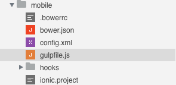

---
---

# Build process introduction

## Table of contents

- [Introduction to Gulp](#introduction-to-gulp)
- [Customize the build process](#customize-the-build-process)
- [Add more modules](#add-more-modules)

## Introduction to Gulp

[Gulp](http://gulpjs.com/) is a build tool based on [Node.js](https://nodejs.org/). It provides a Javascript interface to maintain complex build tasks intuitive and manageable.

You can find different `gulpfile.js` files inside a Wakanda project.

*mobile folder*



*web folder*


These are the entry points of the build process of your application.

Wakanda Studio is able to run the build tasks defined in the `gulpfile.js` files.

[How to install Gulp »](installation.html#increase-your-productivity){:class="btn"}

## Customize the build process

Gulp logic can be summarized by the concept of *tasks*. A `gulpfile.js` can include multiple tasks. When Gulp is launched, it collects all the tasks defined by the user and runs the specified ones.

Gulp is optional. When installed, the Studio is able to run several additional functionalities like the live-reload defined on `web/gulpfile.js`.

On *Run Page* the `serve` task is triggered:

```javascript
gulp.task('serve', ['watch', 'connect']);
```

The first parameter is the task name, 'serve', and the second parameter can be a function or an actions list. By default we run different tasks:

- `connect`: launch a server ready to live-reload when a file change message is received.

```javascript
      gulp.task('connect', function() {
        connect.server({
          root: ['.'],
          port: options.connectPort,
          livereload: {
            port: options.livereloadPort
          },
          middleware: function(conn, opt) {
            return [
              proxy('!/app/**', {
                target: options.serverUrl,
                changeOrigin: false,
                ws: true
              })
            ];
          }
        });
      });
```

- `watch` and `reload`: watch file changements in the specified folders and inform the live-reload server.

```javascript
      var baseFolder = options.app;
      gulp.task('watch', function() {
        gulp.watch([
          baseFolder + 'scripts/**/*.js',
          baseFolder + 'styles/**/*.css',
          baseFolder + 'views/**/*.html',
          baseFolder + 'index.html'
        ], ['reload']);
      });
      gulp.task('reload', function() {
        gulp.src(options.app + '**')
          .pipe(connect.reload());
      });
```

This is the code necessary for the live-reload to work. These tasks are normally different for each project:

- An appropriate folders and/or files list should be provided in the `watch` task.
- Root location, live-reload and proxy settings could be customized when necessary.

## Add more modules

Many additional Gulp modules are available. Here's a list of the most popular packages:

- [Sass](https://www.npmjs.com/package/gulp-sass){:target="blank_"}
- [Less](https://www.npmjs.com/package/gulp-less){:target="blank_"}
- [Babel](https://www.npmjs.com/package/gulp-babel){:target="blank_"}
- [TypeScript](https://www.npmjs.com/package/gulp-typescript){:target="blank_"}
- [CoffeScript](https://www.npmjs.com/package/gulp-coffee){:target="blank_"}
- [Handlebars templates](https://www.npmjs.com/package/gulp-handlebars){:target="blank_"}
- [Mustache templates](https://www.npmjs.com/package/gulp-mustache){:target="blank_"}
- [JS Uglify](https://www.npmjs.com/package/gulp-uglify){:target="blank_"}
- [Imagemin](https://www.npmjs.com/package/gulp-imagemin){:target="blank_"}


---

Let’s see an example:

[Compile SASS files automatically »](sass-precompilation.html){:class="btn"}

