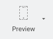
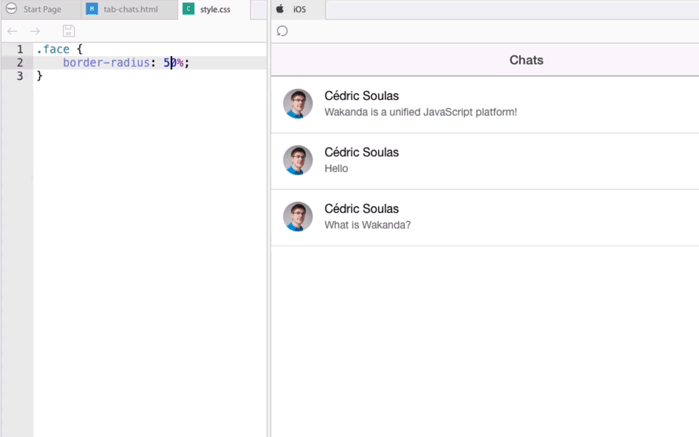
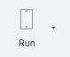
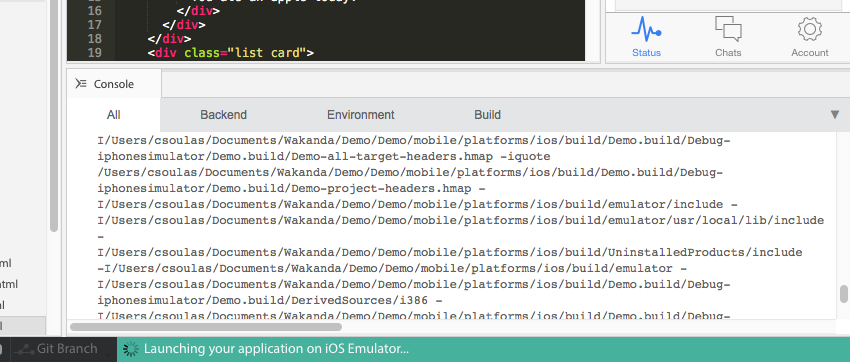
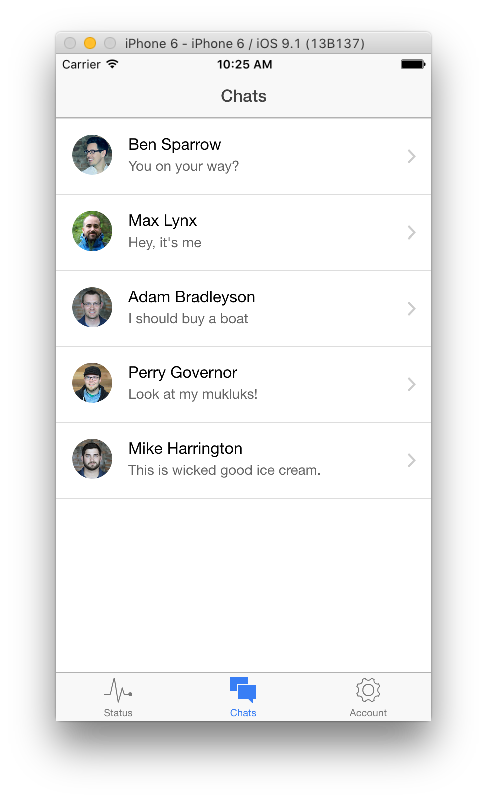
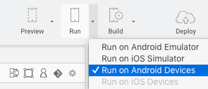
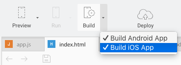
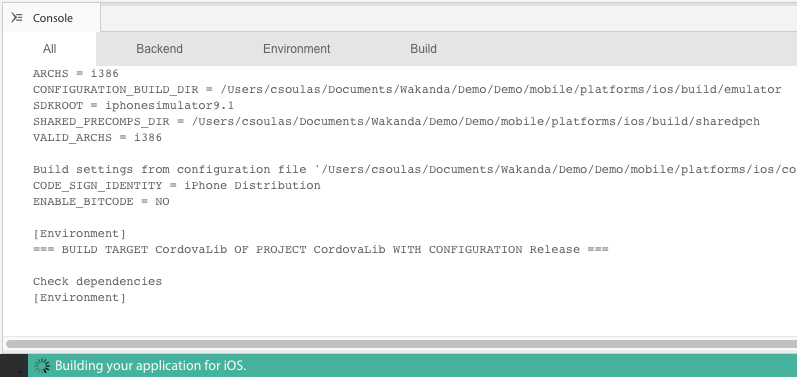
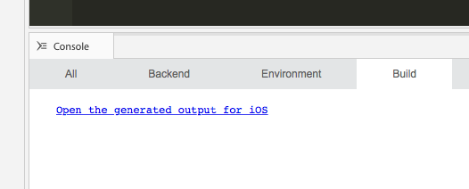

---
---

# Create a mobile app

## Table of contents

- [Preview in the Studio](#preview-in-the-studio)
- [Run on a simulator](#run-on-a-simulator)
- [Run on your devices](#run-on-devices)
- [Build your app](#build-your-app)

## Preview in the Studio

The mobile preview reloads automatically after any file changes occur:

## Run on a simulator

Click on Run and track the progress on the Studio console:

The simulator starts automatically and loads your app:

## Run on devices

- **iOS devices**: sign up for an Apple Developer account and set up XCode with your certificates to enable device testing. You can [build your iOS app](#build-your-app) and open the XCode project generated in `platforms/ios/` to test the configuration.
- **Android devices**: make sure you have [USB debugging enabled](http://developer.android.com/tools/device.html).

Wakanda Studio automatically detects supported device connected to the USB port.
Open the _Run_ dropdown and select the device to run on:

## Build your app

Choose the platforms to build for:

Click on _Build_ to generate a binary based on your [config.xml](http://cordova.apache.org/docs/en/latest/config_ref/index.html){:target="_blank"}:

Then, click on the link to open the generated files:

