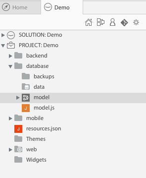
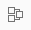
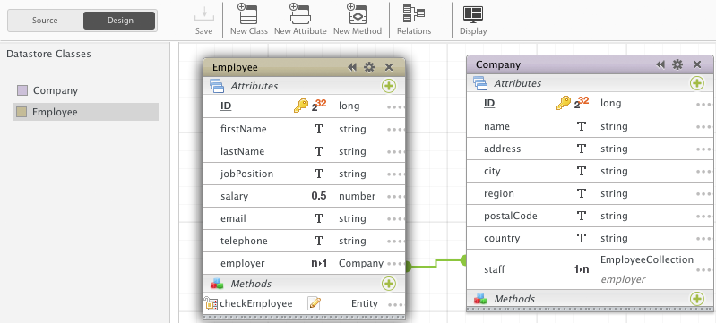
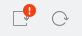

---
---

# Design your data model

## 1 - Open your model

`database/model.waModel`

> **TIPS**: 
> - click on  to change the view options (the `.waModel` extension is hidden by default)
> - click on  to quickly access your model

## 2 - Design your data model

[Learn more »](http://doc.wakanda.org/home2.en.html#/Datastore-Model-Designer/Datastore-Model-Designer.100-1051416.en.html){:target="_blank"}{:class="btn"}

> 
>
> If you need to reload your model in an already started server, a badge will appear in the Studio toolbar. Click on the squared reload button to reload the model. The second one performs a full solution reload.

---

Now, create a web application with Wakanda and Angular:

[Create a web app »](create-web-app.html){:class="btn"}