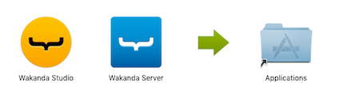
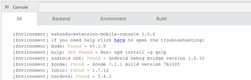
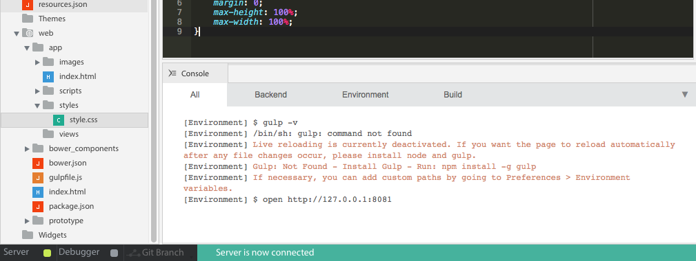
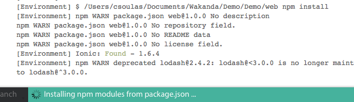
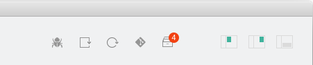

---
---

# Installation

## Table of contents

- [Install Wakanda](#install-wakanda)
- [Setup the mobile stack](#setup-the-mobile-stack)
- [Increase your productivity](#increase-your-productivity)
- [Add extensions](#add-extensions)

## Install Wakanda

Download the latest Wakanda **Community Edition** on [wakanda.github.io](https://wakanda.github.io/){:target="blank_"}.
Find the **Enterprise Edition** on [wakanda.io](http://wakanda.io/){:target="blank_"}.

- On Windows, double-click on the `wakanda-digital-app-factory-xxx.msi` file to launch the installation wizard.
- On Mac OS X, open `wakanda-digital-app-factory-xxx.dmg` file and copy `Wakanda Studio` and `Wakanda Server` in your `Applications` folder:

## Setup the mobile stack

When you create or open a project, your can check in the console for any missing prerequisites: 

For example, you'll need _Xcode_ to create iOS apps or _Android SDK_ for Android apps.

### Troubleshooting

Do you need help? Open the _Mobile Troubleshooting App_ from the console or the main menu (_Help_ > _Wakanda Mobile Troubleshooting_). Then, detect and fix common issues:

## Increase your productivity

### Live reload

The following message in the console warns you when live reload is deactivated:

    
If you want the page to reload automatically after any file changes occur, please install [node](https://nodejs.org/){:target="blank_"} and gulp:

    npm install -g gulp
    
Close the web preview panel and click again on [Run Page](create-web-app.html). The Studio will install automatically the live-reload requierements:

## Add extensions

Improve your development workflow adding and updating Studio extensions.
To do so, open the _Add-ons_ app from the toolbar. The _Add-ons_ badge notifies you when extension updates are available:

---

Now, you are ready to build your app!

[Getting Started »](index.html){:class="btn"}
