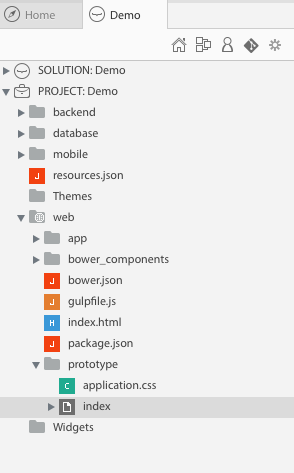
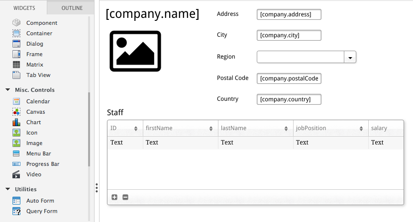
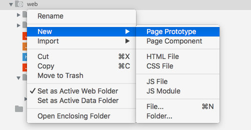

---
---

# Prototype your app

## 1 - Open the default page prototype

`web/prototype/index.waPage`

> **TIPS**: 
> - click on  to change the view options (the `.waPage` extension is hidden by default)
> - click on  to quickly access the `page prototype` index

## 2 - Prototype your page

[Learn more »](http://doc.wakanda.org/home2.en.html#/GUI-Designer/GUI-Designer.100-1051423.en.html){:target="_blank"}{:class="btn"}

## 3 - Run your page

## 4 - Create more pages

> **TIPS**
> - Feel free to create your page prototype directly in the `web` folder or any other sub-folders.

---

Now, create a web application with Wakanda and Angular:

[Create a web app »](create-web-app.html){:class="btn"}
