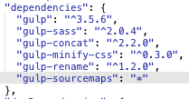
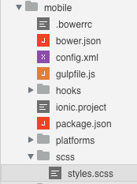
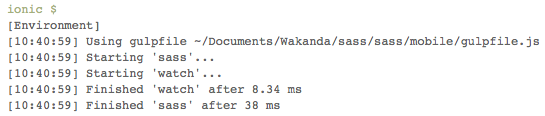

---
---

# SASS precompilation

## Table of contents

- [Add SASS precompilation to your web app](#add-sass-precompilation-to-your-web-app)
- [Customize settings](#customize-settings)
- [Activate the same workflow for mobile apps](#activate-the-same-workflow-for-mobile-apps)

## Add SASS precompilation to your web app

We will see how to add SASS files precompilation to the build process.
You should read the [Build process introduction](build-process-introduction.html) first.

First we need to add to our `package.json` the following dependency:

```json
{
  "devDependencies": {
    "gulp-sass": "*"
  }
}
```
 
Then add the source and the destination folders to the `paths` variable defined in the `gulpfile.js`, as it follows:

```javascript
var paths = {
  // ... html, js and css folders
  sass: {
    src: [baseFolder + 'scss/**/*.scss'],
    dest: baseFolder + 'styles'
  }  
};
```

Now import the `gulp-sass` dependency and create a Gulp task named `sass` with the following code:

```javascript
var sass = require('gulp-sass');

gulp.task('sass', function(done) {
  gulp.src(paths.sass.src) // define sources location
    .pipe(sass()) // start sass process
    .on('error', sass.logError) // halt on errors
    .pipe(gulp.dest(paths.sass.dest)) // copy css into destination
    .on('end', done); // quit
});
```

Finally, enable the `watch` task to look for any file change under the `app/scss` folder with `sass` and `reload` tasks as second parameter:

```javascript
gulp.task('watch', function() {
  gulp.watch(paths.sass.src, ['sass', 'reload']);  
  gulp.watch([
    // ... html, js and css folders
  ], ['reload']);
});
```

This way the Gulp `watch` task will now also trigger the `sass` sources precompilation and the live-reload event.

**Note:** If a Gulp process was already running you must close and re-open your solution to reload the configuration.


## Customize settings

A working `sass` task is now part of the build. We can improve it with additional functionalities:

### SASS options

SASS options can be set passing a parameter object to the `sass()` function:

```javascript
gulp.task('sass', function(done) {
  gulp.src(paths.sass.src)
    .pipe(sass({
      outputStyle: 'compressed' // produce compressed output
    }))
    .on('error', sass.logError)
    .pipe(gulp.dest(paths.sass.dest))    
    .on('end', done);
});
```

SASS compressed output helps to reduce the filesize.

### Minify and rename files

A complete minification can reduce the filesize even further:

```javascript
var minifyCss = require('gulp-minify-css'),
    rename = require('gulp-rename');
    
gulp.task('sass', function(done) {
  gulp.src(paths.sass.src)
    .pipe(sass())
    .on('error', sass.logError)
    .pipe(minifyCss()) // clean and minify *.css files
    .pipe(rename({ extname: '.min.css' })) // rename *.css to *.min.css
    .pipe(gulp.dest(paths.sass.dest))
    .on('end', done);
});
```

**Note:** this functionality requires the following dependencies to be defined in the `package.json` file:

```json
{
  "devDependencies": {
    "gulp-minify-css": "*",
    "gulp-rename": "*"
  }
}
```

### Both compiled and minified versions

In order to produce  both a compiled and a minified version at the same time edit your `sass` task as follows:

```javascript
var minifyCss = require('gulp-minify-css'),
  rename = require('gulp-rename');
    
gulp.task('sass', function(done) {
  gulp.src(paths.sass.src)
    .pipe(sass())
    .on('error', sass.logError)
    .pipe(gulp.dest(paths.sass.dest)) // copy *.css to destination
    .pipe(minifyCss())
    .pipe(rename({ extname: '.min.css' }))
    .pipe(gulp.dest(paths.sass.dest)) // copy *.min.css to destination
    .on('end', done);
});
```

**Note:** this functionality requires the following dependencies to be defined in the `package.json` file:

```json
{
  "devDependencies": {
    "gulp-minify-css": "*",
    "gulp-rename": "*"
  }
}
```

### Sourcemaps
In order to add sourcemaps edit your `sass` task as follows:

```javascript
var sourcemaps = require('gulp-sourcemaps');
gulp.task('sass', function(done) {
  gulp.src(paths.sass.src)
    .pipe(sourcemaps.init()) // generate sourcemaps
    .pipe(sass())
    .on('error', sass.logError)
    .pipe(sourcemaps.write()) // write sourcemaps into *.css
    .pipe(gulp.dest(paths.sass.dest))
    .on('end', done);
});
```

**Note:** this functionality requires the following dependencies to be defined in the `package.json` file:

```json
{
  "devDependencies": {
    "gulp-sourcemaps": "*"
  }
}
```
You can now found your sourcemaps inside the output file as a comment:

```css
/*# sourceMappingURL=data:application/json;base64,eyJ2ZXJzaW9uIjo...
```

### Minify and rename, original and source maps

The combination of all:

```javascript
var sourcemaps = require('gulp-sourcemaps'),
  minifyCss = require('gulp-minify-css'),
  rename = require('gulp-rename');

gulp.task('sass', function(done) {
  gulp.src(paths.sass.src) // define sources location
    .pipe(sourcemaps.init()) // generate sourcemaps
    .pipe(sass()) // start sass process
    .on('error', sass.logError) // halt on errors
    .pipe(sourcemaps.write()) // write sourcemaps into *.css
    .pipe(gulp.dest(paths.sass.dest)) // copy *.css into destination
    .pipe(minifyCss()) // clean and minify *.css
    .pipe(rename({ extname: '.min.css' })) // rename *.css to *.min.css
    .pipe(sourcemaps.write()) // re-write sourcemaps into *.min.css
    .pipe(gulp.dest(paths.sass.dest)) // copy *.min.css to destination
    .on('end', done); // quit
});
```

**Note:** this functionality requires the following dependencies to be defined in the `package.json` file:

```json
{
  "devDependencies": {
    "gulp-minify-css": "*",
    "gulp-rename": "*",
    "gulp-sourcemaps": "*"
  }
}
```

## Activate the same workflow for mobile apps

We will now evaluate how to integrate the same workflow in our Wakanda Ionic-based mobile application. Inside the `mobile` folder you can find a `gulpfile.js` file. However this build process is slightly different:

- Ionic includes a live-reload mechanism for `www` folder. Thus a Gulp live-reload implementation is not necessary.
- Ionic already includes a snippet of code to support SASS precompilation.
- Ionic takes into consideration only the Gulp tasks defined in the `ionic.project` file.
- Node.js modules are not installed by default in the `mobile` folder.

In order:

1 - Add to the `package.json` inside your `mobile` folder any Gulp dependency you may need. Following the example above we will need to add only `gulp-sourcemaps` to the dependencies already provided:
    
    
    
  
2 - Run in the terminal `npm install` while inside your `mobile` folder to install all the Gulp and SASS dependencies defined in the `package.json` file.

3 - Create a `scss` folder inside the `mobile` folder and put our sass sources inside:
  
     
  
Being outside of the `www` folder, SASS sources won't included in the final application package.
  
4 - Customize the `sass` task inside the `gulpfile.js` to be coherent with your project scaffolding:

```javascript
// 1 - change sass paths like this
var paths = {
  sass: {
    src: ['./scss/**/*.scss'],
    dest: './www/css/'
  }
};

// 2 - add missing require
var sourcemaps = require('gulp-sourcemaps');

// 3 - add missing tasks
gulp.task('sass', function(done) {
  gulp.src(paths.sass.src)
    .pipe(sourcemaps.init())
    .pipe(sass())
    .on('error', sass.logError)
    .pipe(sourcemaps.write())
    .pipe(minifyCss())
    .pipe(rename({ extname: '.min.css' }))
    .pipe(gulp.dest(paths.sass.dest))
    .on('end', done);
});
gulp.task('watch', function() {
  gulp.watch(paths.sass.src, ['sass']); // 'reload' task is not necessary
});
```

5 - Finally, tell Ionic which Gulp tasks you want to run. Add this line inside the `ionic.project` file:
  
```
       "gulpStartupTasks": ["sass", "watch"],
```

6 - Now click on any mobile action button (for instance Preview). If the configuration is correct you should see the following output in the console:

  
    
  and when saving your sass sources:
    
  
       
**Note:** If a Ionic process was already running you must close and re-open your solution to reload the configuration.

