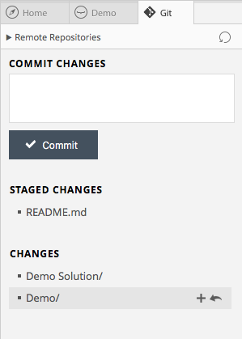
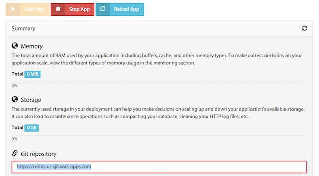
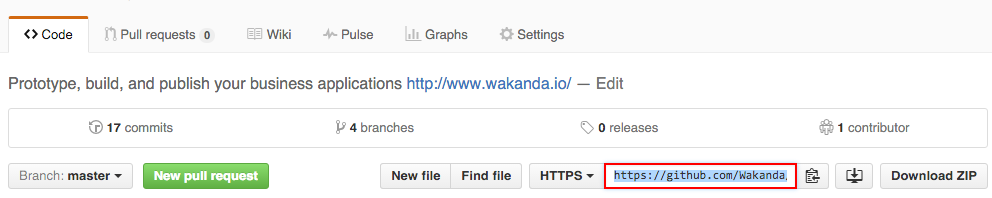
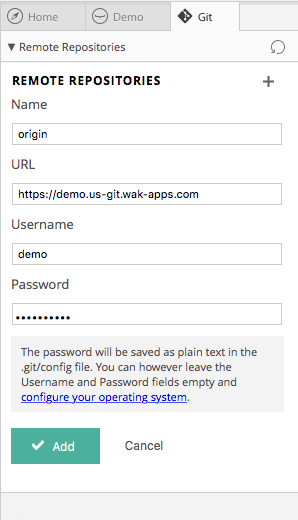

---
---

# Version control your code

## Create a repository

From the solution explorer, click on  to open Git.
Then, click on _Create Git Repository_.

## Commit your changes

Add changes to your stage and commit:

<h2 id="remote">Add a remote repository</h2>

Retrieve your remote repository URL from [Wakanda Cloud](https://console.wakanda.io){:target="_blank"} or Github:

### Wakanda Cloud

[Create a new cloud server instance](http://docs.wakcloud.com/en/latest/getting_started.html){:target="_blank"} and copy the Git repository URL:

### Github

### Setup

Click on  to open the remote repositories panel.

And setup your remote settings:

**IMPORTANT**: the password will be saved as plain text in the `.git/config` file.
You can however leave the Username and Password fields empty and cache your password in Git.

### Cache your password in Git

**Mac OS X**

    git config --global credential.helper osxkeychain
    
[More info  »](https://help.github.com/articles/caching-your-github-password-in-git/#platform-mac){:target="_blank"}

**Windows**

    git config --global credential.helper wincred
    
[More info  »](https://help.github.com/articles/caching-your-github-password-in-git/#platform-windows){:target="_blank"}

---

Now, deploy your app:

[Deploy your app »](deploy-your-app.html){:class="btn"}